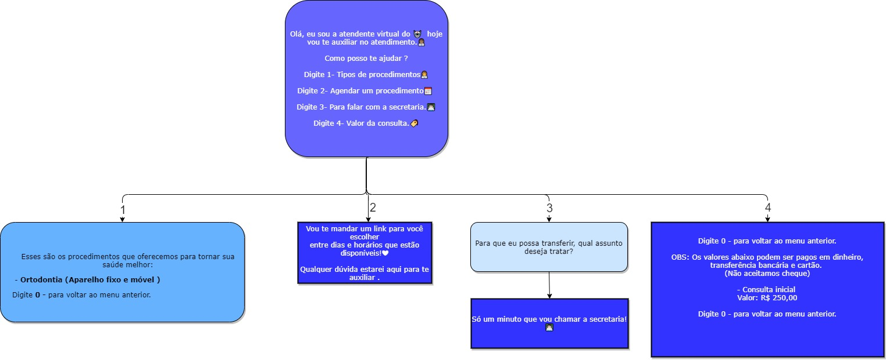

<h2 align="center">
  
  
   
  <b>Chat-bot Whatsapp</b>
</h2>

### O que é?

- Bot para whatsApp simples criado para uma clinica.
  

  
### Screenshot

    
### O que utiliza?

 
 - NODE 

 
 - Venom 

### Como rodar?

 
 1. git clone https://github.com/iagoln/Bot-WhatsApp.git 

 
 2. cd Bot-WhatsApp 

 
 3. npm Install 

 
 4. npm Start 

 
 5. abra a ferramenta do whatsapp-web no seu whatsapp e scannei o QRcode 

   

<h2 align="center">
    <b>Diagrama</b>
  
  

   

</h2>
